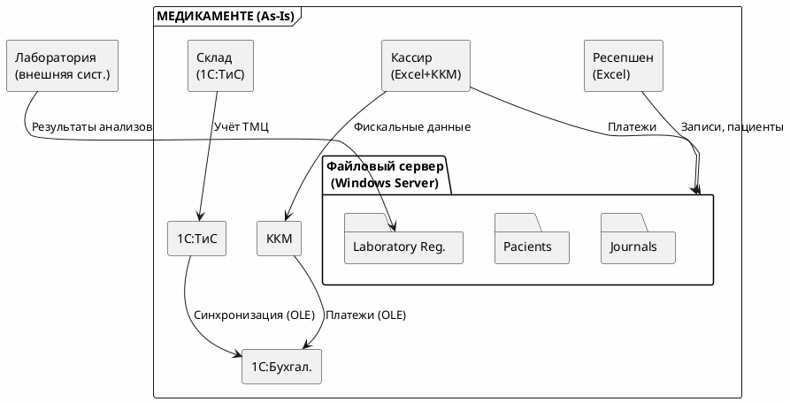

# Анализ As-Is архитектуры компании «Медикаменте»

## 1. Введение

### 1.1. Назначение документа

Данный документ представляет собой детальный анализ текущего состояния (As-Is) информационной системы компании «Медикаменте». Цель анализа — понять существующую архитектуру, бизнес-процессы и технологический стек для последующего выявления уязвимостей безопасности и проектирования целевой архитектуры (To-Be).

### 1.2. Методология анализа

Анализ проведён по следующим направлениям:
- **Организационная структура** — понимание ролей сотрудников и их взаимодействия с данными
- **Технологический стек** — инвентаризация используемого программного обеспечения и инфраструктуры
- **Бизнес-процессы** — описание ключевых процессов обработки данных
- **Потоки данных** — визуализация перемещения информации между системами
- **Проблемные зоны** — предварительная оценка уязвимостей и рисков

---

## 2. Общая информация о компании

### 2.1. Организационная структура

Понимание организационной структуры компании критически важно для проектирования системы контроля доступа (RBAC/ABAC). Каждая роль в компании определяет набор данных, с которыми сотрудник взаимодействует в ходе выполнения своих обязанностей. Ниже представлена структура компании «Медикаменте» на момент проведения аудита:

| Отдел | Количество сотрудников | Функции |
|-------|------------------------|---------|
| Медицинские специалисты | 15 | Приём пациентов, ведение медицинских карт |
| Ресепшен | 3 | Журнал записей, клиентские контракты |
| Кассиры | 3 | Приём платежей, учёт в Excel и 1С |
| Бухгалтерия | 3 | Процессинг платежей, кадровый учёт, зарплаты, налоги |
| Склад | 3 | Учёт ТМЦ, закупки оборудования |
| IT-отдел | 3 | Архитектура, администрирование, аналитика |

**Итого:** 43 сотрудника (планируется расширение для поддержки 5-кратного роста)

**Контекст для архитектуры безопасности:**
- **Масштабирование:** Планируемый 5-кратный рост компании означает, что архитектура должна быть спроектирована с запасом производительности и возможностью горизонтального масштабирования
- **Разделение обязанностей:** Чёткое разделение на отделы определяет границы доступа к данным — например, кассиры не должны иметь доступ к медицинским картам, а врачи — к зарплатам сотрудников
- **Рост нагрузки:** Увеличение числа пациентов и транзакций потребует перехода от файловых хранилищ к клиент-серверной СУБД

---

## 3. Технологический стек As-Is

### 3.1. Программное обеспечение

Технологический стек компании «Медикаменте» отражает типичную ситуацию для малого бизнеса, где ИТ-инфраструктура развивалась эволюционно, без единого архитектурного видения. Выбор инструментов в прошлом определялся критериями доступности и простоты внедрения, а не требованиями безопасности. Это привело к фрагментированной архитектуре с множеством ручных процессов.

| Система | Назначение | Режим работы | Критичность для безопасности |
|---------|------------|--------------|------------------------------|
| Excel | Журналы, учёт пациентов, платежи | Локальные файлы | **Критично** — хранит ПИИ без защиты |
| Outlook | Электронная почта | Локальный клиент | **Средне** — переписка может содержать ПДн |
| 1С:Бухгалтерия предприятия | Бухгалтерский учёт, кадры, налоги | Файловый режим | **Критично** — зарплаты, персональные данные |
| 1С:Торговля и склад | Учёт ТМЦ | Файловый режим | **Средне** — бизнес-данные |
| Microsoft Windows Server 2022 | Серверная ОС | Физический сервер | **Критично** — основа инфраструктуры |

**Архитектурные проблемы текущего стека:**
- **Файловый режим работы** — 1С и Excel не предназначены для многопользовательской работы с конфиденциальными данными, отсутствуют транзакции и механизмы блокировок
- **Отсутствие специализированной СУБД** — данные хранятся в файловых форматах, что не позволяет реализовать безопасность на уровне строк (RLS) и детальный аудит
- **Ручные процессы** — значительная часть обработки данных выполняется вручную, что повышает риск ошибок и утечек

### 3.2. Серверная инфраструктура

**Физический сервер в здании компании:**

Серверная инфраструктура развёрнута на физическом сервере, расположенном в помещении компании. Такой подход имеет преимущества для compliance с 152-ФЗ (требование локализации данных на территории РФ), но создаёт операционные риски:

- **Active Directory** — доменная аутентификация всех сотрудников, централизованное управление учётными записями
- **DNS** — разрешение имён в локальной сети
- **DHCP** — автоматическая выдача IP-адресов
- **LDAP** — каталог пользователей и групп
- **Файловый сервер** — централизованное хранение файлов Excel, документов пациентов
- **Exchange Mail Server** — корпоративная электронная почта

**Риски инфраструктуры:**
- **Единая точка отказа** — выход сервера из строя парализует все бизнес-процессы
- **Отсутствие гео-распределения** — все данные в одном месте, уязвимость к физическим угрозам (пожар, потоп)
- **Нет аварийного восстановления** — не описана процедура DRP (Disaster Recovery Plan)

### 3.3. Контрольно-кассовые машины (ККМ)

- **Подключение через TCP/IP** — сетевое взаимодействие в локальной сети
- **Интеграция с 1С через OLE** — технология автоматизации Microsoft для межприложенного взаимодействия

**Проблемы интеграции ККМ:**
- **OLE — устаревшая технология** — не поддерживает современные протоколы безопасности
- **Локальная сеть без сегментации** — ККМ находятся в той же сети, что и серверы с конфиденциальными данными
- **Нет шифрования трафика** — данные о платежах передаются в открытом виде

---

## 4. Бизнес-процессы компании

Бизнес-процессы компании «Медикаменте» представляют собой последовательности операций, в ходе которых обрабатываются конфиденциальные данные пациентов и сотрудников. Анализ каждого процесса позволяет выявить точки сбора, хранения и передачи данных, а также определить потенциальные уязвимости.

Ниже описаны шесть ключевых бизнес-процессов компании. Для каждого процесса указаны участники, текущий порядок выполнения, обрабатываемые данные и используемые хранилища. Эта информация станет основой для построения диаграмм потоков данных (DFD) и последующего аудита безопасности.

### 4.1. Запись пациента к врачу
**Участники:** Пациент, Ресепшен, Медицинский специалист

**Контекст процесса:** Запись пациента — это первая точка контакта клиента с информационной системой клиники. На этом этапе собираются первичные персональные данные (ФИО, телефон), которые требуют защиты в соответствии с 152-ФЗ. Процесс полностью ручной и зависит от доступности ресепшена, что создаёт операционные риски и ограничивает масштабируемость.

**Текущий процесс:**
1. Пациент обращается к ресепшену (телефон/лично)
2. Ресепшен вручную записывает пациента в Excel-журнал специалиста
3. Ресепшен регистрирует данные пациента в общем Excel-файле
4. Данные пациента сохраняются в папке на файловом сервере

**Данные:**
- ФИО пациента
- Дата рождения
- Контактные данные (телефон, email)
- Дата и время приёма
- Специалист

**Хранилища:**
- Excel-файл `Patients.xlsx` (список всех пациентов)
- Excel-файлы `Journal-Doctor-{FIO}.xlsx` (журналы специалистов)
- Папка `Pacients/{FIO-BD}/` с файлами пациента

**Проблемы безопасности:**
- Excel-файлы доступны всем сотрудникам домена без разграничения
- Нет шифрования персональных данных
- Отсутствует аудит — невозможно отследить, кто просматривал журнал
- Ручной ввод повышает риск ошибок и несанкционированных изменений

---

### 4.2. Ведение медицинской карты пациента
**Участники:** Пациент, Ресепшен, Медицинский специалист

**Контекст процесса:** Ведение медицинской карты — центральный процесс, в ходе которого формируется и накапливается конфиденциальная медицинская информация о пациенте. Медицинские данные относятся к специальной категории персональных данных и требуют максимальной защиты согласно 152-ФЗ. Утечка диагнозов или результатов анализов может нанести непоправимый репутационный ущерб пациенту и привести к серьёзным штрафам для клиники.

**Текущий процесс:**
1. При первом приёме ресепшен создаёт папку пациента
2. Медицинский специалист заполняет документы во время приёма
3. Документы сохраняются в различных форматах (Excel, JPG, PDF)
4. Файлы хранятся в папке пациента на файловом сервере

**Данные:**
- Персональные данные (ФИО, ДР, адрес, телефон)
- Медицинская информация (диагнозы, назначения, заключения)
- Результаты анализов
- Договоры на оказание услуг

**Хранилища:**
- Папка `Pacients/{FIO-BD}/Data files`
- Различные форматы: XLSX, JPG, PDF

**Проблемы безопасности:**
- Медицинские данные хранятся в открытом виде без шифрования
- Все врачи видят все медицинские карты — нет разделения по лечащим врачам
- Отсутствует аудит просмотров — невозможно выявить несанкционированный доступ
- Смешанное хранение ПИИ и медицинских данных в одной папке
- Нет версионности документов — возможна утеря или подмена записей

---

### 4.3. Оплата медицинских услуг
**Участники:** Пациент, Кассир, Бухгалтер

**Контекст процесса:** Процесс оплаты затрагивает как персональные данные пациентов, так и финансовую информацию о транзакциях. Хотя финансовые данные менее чувствительны, чем медицинские, их утечка может привести к финансовому мошенничеству. Кроме того, связь между пациентом и суммой платежа может раскрыть информацию о полученных услугах (например, дорогостоящее лечение).

**Текущий процесс:**
1. Пациент оплачивает услуги на кассе
2. Кассир принимает платеж через ККМ
3. Кассир регистрирует платеж в Excel
4. Данные передаются в 1С:Бухгалтерия через OLE
5. Бухгалтер обрабатывает платежи в 1С

**Данные:**
- Сумма платежа
- Тип услуги
- Данные пациента
- Чек ККМ

**Хранилища:**
- Excel-файл кассира
- 1С:Бухгалтерия предприятия
- ККМ (фискальные данные)

**Проблемы безопасности:**
- Файловый режим 1С не обеспечивает надёжную защиту финансовых данных
- Нет детализации прав внутри 1С — все кассиры видят все платежи
- Журнал аудита 1С не настроен на критичные операции
- Интеграция через OLE не использует современные протоколы безопасности

---

### 4.4. Учёт товарно-материальных ценностей
**Участники:** Склад, Бухгалтерия

**Контекст процесса:** Учёт ТМЦ обеспечивает контроль за движением медикаментов, оборудования и расходных материалов. Хотя данные о ТМЦ не относятся к персональным, информация о стоимости и поставщиках представляет коммерческую ценность. Утечка данных о поставщиках может быть использована конкурентами.

**Текущий процесс:**
1. Сотрудник склада ведёт учёт ТМЦ в 1С:Торговля и склад
2. Данные синхронизируются с 1С:Бухгалтерия через OLE
3. Бухгалтерия отражает ТМЦ в бухгалтерском учёте

**Данные:**
- Наименование ТМЦ
- Количество
- Стоимость
- Движение ТМЦ (приход/расход)

**Хранилища:**
- 1С:Торговля и склад
- 1С:Бухгалтерия предприятия

**Проблемы безопасности:**
- Нет разграничения доступа к данным о поставщиках
- Синхронизация между 1С не логируется детально
- Файловый режим ограничивает возможности аудита

---

### 4.5. Лабораторные анализы
**Участники:** Пациент, Медицинский специалист, Лаборатория

**Контекст процесса:** Лабораторные анализы — процесс с внешним контуром, так как биоматериал и направления передаются за пределы информационной системы. Результаты анализов относятся к медицинской тайне и требуют особой защиты. Процесс включает как физическую передачу биоматериала, так и электронную регистрацию результатов.

**Текущий процесс:**
1. Врач назначает анализы пациенту
2. Пациент сдаёт анализы в лаборатории
3. Лаборатория передаёт результаты
4. Результаты регистрируются в Excel-реестре
5. Результаты подшиваются к медицинской карте пациента

**Данные:**
- Направления на анализы
- Результаты анализов
- Реестры анализов за день

**Хранилища:**
- Папка `Laboratory Registry/`
- Excel-файлы `RegistryByDate.xlsx`
- Папка пациента с результатами

**Проблемы безопасности:**
- Результаты анализов доступны всем сотрудникам без разграничения
- Нет разделения доступа по пациентам и лечащим врачам
- Передача результатов пациенту не логируется
- Бумажные носители могут быть утеряны или перехвачены

---

### 4.6. Бухгалтерский учёт
**Участники:** Бухгалтер

**Контекст процесса:** Бухгалтерский учёт включает обработку платежей пациентов, кадровый учёт сотрудников, начисление зарплат и подготовку налоговой отчётности. Этот процесс концентрирует наиболее чувствительные финансовые данные — зарплаты сотрудников, которые являются коммерческой тайной и должны быть доступны ограниченному кругу лиц.

**Текущий процесс:**
1. Бухгалтер обрабатывает платежи в 1С:Бухгалтерия
2. Ведётся кадровый учёт сотрудников
3. Начисляется зарплата
4. Готовится документация для налоговых органов

**Данные:**
- Платежи пациентов
- Зарплаты сотрудников
- Кадровые данные
- Налоговая отчётность

**Хранилища:**
- 1С:Бухгалтерия предприятия

**Проблемы безопасности:**
- Зарплаты сотрудников видны всем бухгалтерам — нет детализации доступа
- Паспортные данные сотрудников не зашифрованы
- Нет разграничения доступа к кадровым данным внутри бухгалтерии
- Налоговая отчётность

**Хранилища:**
- 1С:Бухгалтерия предприятия

---

## 5. Потоки данных между системами

### 5.1. Схема взаимодействий

Диаграмма ниже визуализирует потоки данных между основными системами компании «Медикаменте». Стрелки показывают направление передачи информации, что позволяет выявить точки потенциальной утечки данных и определить приоритеты для внедрения мер защиты.

Ключевые наблюдения:
- **Файловый сервер** — центральный узел, через который проходит большинство потоков данных
- **Лаборатория** — внешний субъект, передающий результаты анализов (риск выхода за периметр)
- **1С:Бухгалтерия** — получает данные из multiple sources (касса, склад), что создаёт риски рассинхронизации

---

## 6. Проблемы текущей архитектуры

На основе анализа бизнес-процессов и потоков данных выявлены следующие системные проблемы архитектуры As-Is. Проблемы сгруппированы по четырём категориям: хранение данных, безопасность, масштабируемость и соответствие законодательству. Каждая проблема будет рассмотрена детально в документе аудита безопасности ([security_audit.md](../02_аудит_мер/security_audit.md)).

### 6.1. Хранение данных
| Проблема | Описание | Риск |
|----------|----------|------|
| Файловое хранение | Данные в Excel-файлах на общем диске | Утечка, потеря |
| Отсутствие БД | Нет централизованной СУБД | Несогласованность |
| Дублирование | Данные в нескольких файлах | Рассинхронизация |
| Нет резервирования | Не описана стратегия backup | Потеря данных |

### 6.2. Безопасность
| Проблема | Описание | Риск |
|----------|----------|------|
| Нет шифрования | Данные хранятся в открытом виде | Чтение при утечке |
| Нет аудита | Не логируется доступ к файлам | Невозможно отследить утечку |
| Нет RBAC | Доступ по доменной аутентификации | Избыточные права |
| Нет разграничения | Все видят все файлы | Нарушение конфиденциальности |

### 6.3. Масштабируемость
| Проблема | Описание | Риск |
|----------|----------|------|
| Файловый режим 1С | Не поддерживает много пользователей | Блокировки при росте |
| Ручная обработка | Много ручного труда | Ошибки при росте нагрузки |
| Нет автоматизации | Запись только через ресепшен | Очереди, недовольство |

### 6.4. Соответствие законодательству
| Проблема | Описание | Риск |
|----------|----------|------|
| 152-ФЗ | Нет мер защиты ПДн | Штрафы |
| Нет согласия | Не описан процесс получения | Нарушение прав |
| Нет удаления | Не реализовано право на забвение | Нарушение прав |

---

## 7. Выводы

### 7.1. Резюме анализа As-Is

Проведённый анализ текущей архитектуры компании «Медикаменте» выявил системные проблемы в области защиты конфиденциальных данных. Архитектура, сложившаяся исторически, не соответствует требованиям 152-ФЗ и не готова к планируемому 5-кратному росту компании.

**Текущее состояние:**
- Все данные хранятся в файловом формате (Excel, JPG, PDF)
- 1С работает в файловом режиме с интеграцией через OLE
- Нет централизованной системы управления данными
- Отсутствует аудит и контроль доступа
- Нет мер защиты конфиденциальных данных

**Критические риски:**
- Медицинские данные доступны всем сотрудникам без разграничения
- Персональные данные пациентов хранятся в открытом виде
- Невозможно отследить утечку или несанкционированный доступ
- Высокий риск штрафов от Роскомнадзора

### 7.2. Необходимые улучшения

На основе анализа As-Is сформулированы следующие приоритетные направления модернизации архитектуры:

1. **Переход на клиент-серверную архитектуру** — замена файловых хранилищ на специализированную СУБД
2. **Внедрение СУБД (PostgreSQL)** — использование pgcrypto для шифрования, RLS для разграничения доступа
3. **Реализация RBAC/ABAC для контроля доступа** — разграничение прав на основе ролей и атрибутов
4. **Шифрование конфиденциальных данных** — AES-256 для медицинских данных и ПИИ
5. **Аудит всех операций с данными** — логирование обращений к конфиденциальным данным
6. **Механизм тегирования данных** — автоматическая классификация по уровням чувствительности
7. **Автоматизация записи пациентов** — снижение ручного труда, уменьшение ошибок

Эти улучшения лягут в основу целевой архитектуры (To-Be), которая будет рассмотрена в документе [protection_measures.md](../03_улучшения/protection_measures.md).