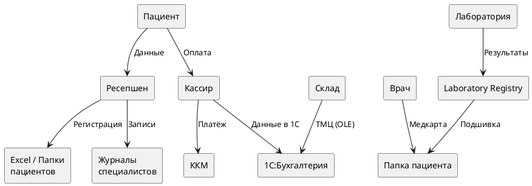

# Реестр конфиденциальных данных компании «Медикаменте»

## 1. Введение

### 1.1. Назначение документа

Данный документ представляет собой реестр конфиденциальных данных компании «Медикаменте». Реестр создан на основе анализа бизнес-процессов ([as_is_analysis.md](as_is_analysis.md)) и служит фундаментом для проектирования мер защиты информации.

Реестр выполняет следующие функции:
- **Инвентаризация данных** — полный перечень всех категорий данных, обрабатываемых в компании
- **Классификация по чувствительности** — присвоение уровня конфиденциальности каждой категории
- **Определение местоположения** — фиксация физических и логических хранилищ данных
- **Обоснование защиты** — определение необходимых мер для каждой категории

### 1.2. Методология классификации

Классификация данных проведена на основе следующих критериев:
- **Тип данных** — принадлежность к категории (PII, медицинские, финансовые, служебные)
- **Чувствительность** — потенциальный ущерб от утечки (высокий, средний, низкий, публичный)
- **Требования законодательства** — применимость 152-ФЗ, врачебной тайны, налоговой тайны
- **Контекст использования** — как данные используются в бизнес-процессах

### 1.3. Связь с другими документами

Этот реестр является входными данными для:
- **Аудита безопасности** ([security_audit.md](../02_аудит_мер/security_audit.md)) — оценка текущих мер защиты для каждой категории
- **Мер защиты** ([protection_measures.md](../03_улучшения/protection_measures.md)) — выбор инструментов шифрования, маскирования, контроля доступа
- **Тегирования данных** ([data_tagging_concept.md](../03_улучшения/data_tagging_concept.md)) — присвоение тегов для автоматической классификации

---

## 2. Классификация данных по уровням чувствительности

### 2.1. Уровни конфиденциальности

Классификация данных по уровням чувствительности определяет строгость применяемых мер защиты. Чем выше уровень, тем более строгие требования предъявляются к шифрованию, контролю доступа и аудиту.

В компании «Медикаменте» выделено четыре уровня конфиденциальности:

| Уровень | Описание | Примеры | Меры защиты |
|---------|----------|---------|-------------|
| **Высокий** | Особо чувствительные данные, требующие максимальной защиты | Медицинские диагнозы, результаты анализов, биометрические данные | AES-256 + ABAC + полный аудит |
| **Средний** | Персональные данные, ПИИ | ФИО, паспортные данные, адрес, телефон | Шифрование + RBAC + маскирование |
| **Низкий** | Внутренние служебные данные | Журналы записей, реестры, справочники | RBAC + базовый аудит |
| **Публичный** | Неконфиденциальные данные | Прайс-лист, информация о компании | Без ограничений |

**Обоснование классификации:**
- **Высокий уровень** включает медицинские данные, так как их утечка может привести к дискриминации пациента, шантажу, репутационному ущербу. Также к этой категории относятся паспортные данные и зарплаты сотрудников.
- **Средний уровень** охватывает базовые ПИИ (ФИО, телефон, email), которые сами по себе менее чувствительны, но в сочетании с медицинскими данными становятся критичными.
- **Низкий уровень** — служебная информация, утечка которой не нанесёт прямого ущерба, но может раскрыть внутренние процессы компании.
- **Публичный уровень** — данные, предназначенные для свободного доступа.

---

## 3. Реестр данных

В этом разделе представлен детальный реестр всех категорий данных, выявленных в компании «Медикаменте». Для каждой категории указаны уровень конфиденциальности, тип данных, формат и местоположение хранения, а также необходимость защиты.

Реестр разделён на пять логических групп:
- **Данные пациентов** — персональные и медицинские данные клиентов клиники
- **Финансовые данные** — информация о платежах и финансовых операциях
- **Данные сотрудников** — кадровая информация и учётные данные
- **Данные ТМЦ** — учёт товарно-материальных ценностей
- **Служебные данные** — внутренняя рабочая информация

### 3.1. Данные пациентов

Данные пациентов представляют наибольшую ценность и одновременно наибольший риск. Эта категория включает как базовые персональные данные (ФИО, телефон), так и специальную категорию — медицинские сведения. Согласно 152-ФЗ, медицинские данные относятся к специальной категории персональных данных и требуют максимальной защиты.

**Ключевые характеристики:**
- **Объём:** 14 категорий данных
- **Уровни:** Высокий (медицинские), Средний (ПИИ)
- **Хранилища:** Excel-файлы, папки пациентов, журналы специалистов
- **Критичность:** Все данные требуют защиты

| Категория данных | Уровень | Тип данных | Формат хранения | Местоположение | Требует защиты |
|------------------|---------|------------|-----------------|----------------|----------------|
| **ФИО пациента** | Средний | PII | Текст | Excel: Patients.xlsx, папки пациентов | ✅ |
| **Дата рождения** | Средний | PII | Дата | Excel: Patients.xlsx, папки пациентов | ✅ |
| **Паспортные данные** | Высокий | PII | Текст | Папки пациентов (сканы) | ✅ |
| **Адрес прописки** | Средний | PII | Текст | Расширенная форма пациента | ✅ |
| **Телефон** | Средний | PII | Текст | Excel: Patients.xlsx, журналы | ✅ |
| **Email** | Средний | PII | Текст | Excel: Patients.xlsx | ✅ |
| **Место работы/учёбы** | Средний | PII | Текст | Расширенная форма пациента | ✅ |
| **Хронические заболевания** | Высокий | Медицинские | Текст | Медицинская карта | ✅ |
| **Диагнозы** | Высокий | Медицинские | Текст | Медицинская карта | ✅ |
| **Назначения врача** | Высокий | Медицинские | Текст | Медицинская карта | ✅ |
| **Результаты анализов** | Высокий | Медицинские | Текст, изображения | Laboratory Registry, папка пациента | ✅ |
| **Заключения специалистов** | Высокий | Медицинские | Текст, PDF | Папка пациента | ✅ |
| **Договор на услуги** | Средний | Финансовые | Текст, PDF | Папка пациента | ✅ |
| **История посещений** | Средний | PII + Медицинские | Текст | Журналы специалистов | ✅ |

---

### 3.2. Финансовые данные

Финансовые данные охватывают информацию о платежах пациентов и финансовых транзакциях компании. Хотя эти данные менее чувствительны, чем медицинские, их утечка может привести к финансовому мошенничеству. Кроме того, связь между пациентом и суммой платежа может косвенно раскрыть информацию о полученных услугах.

**Ключевые характеристики:**
- **Объём:** 5 категорий данных
- **Уровни:** Средний (платежи), Низкий (справочники)
- **Хранилища:** Excel кассира, 1С:Бухгалтерия, ККМ
- **Критичность:** Требуют защиты платежи и история транзакций

| Категория данных | Уровень | Тип данных | Формат хранения | Местоположение | Требует защиты |
|------------------|---------|------------|-----------------|----------------|----------------|
| **Сумма платежа** | Средний | Финансовые | Число | Excel кассира, 1С:Бухгалтерия | ✅ |
| **Тип услуги** | Низкий | Справочник | Текст | Excel, 1С | ❌ |
| **Чек ККМ** | Низкий | Финансовые | Текст | ККМ, 1С | ❌ |
| **История платежей пациента** | Средний | Финансовые | Текст | 1С:Бухгалтерия | ✅ |
| **Задолженности** | Средний | Финансовые | Число | 1С:Бухгалтерия | ✅ |

---

### 3.3. Данные сотрудников

Данные сотрудников включают персональные данные работников, информацию о зарплатах и учётные данные доменной инфраструктуры. Зарплаты сотрудников являются коммерческой тайной и должны быть доступны только ограниченному кругу лиц в бухгалтерии. Учётные данные AD критичны для безопасности всей инфраструктуры.

**Ключевые характеристики:**
- **Объём:** 7 категорий данных
- **Уровни:** Высокий (зарплаты, паспортные данные, AD), Средний (ФИО, контакты)
- **Хранилища:** 1С:Бухгалтерия, Active Directory
- **Критичность:** Зарплаты и паспортные данные требуют максимальной защиты

| Категория данных | Уровень | Тип данных | Формат хранения | Местоположение | Требует защиты |
|------------------|---------|------------|-----------------|----------------|----------------|
| **ФИО сотрудника** | Средний | PII | Текст | 1С:Бухгалтерия, AD | ✅ |
| **Должность** | Низкий | Справочник | Текст | 1С:Бухгалтерия, AD | ❌ |
| **Зарплата** | Высокий | Финансовые | Число | 1С:Бухгалтерия | ✅ |
| **Паспортные данные** | Высокий | PII | Текст | 1С:Бухгалтерия (кадры) | ✅ |
| **ИНН, СНИЛС** | Высокий | PII | Текст | 1С:Бухгалтерия (кадры) | ✅ |
| **Контактные данные** | Средний | PII | Текст | 1С:Бухгалтерия, AD | ✅ |
| **Учётные данные AD** | Высокий | Учётные | Текст | Active Directory | ✅ |

---

### 3.4. Данные ТМЦ (товарно-материальные ценности)

Данные ТМЦ обеспечивают учёт медикаментов, оборудования и расходных материалов. Хотя наименования и количество ТМЦ не являются конфиденциальными, информация о стоимости и поставщиках представляет коммерческую ценность. Утечка данных о поставщиках может быть использована конкурентами.

**Ключевые характеристики:**
- **Объём:** 5 категорий данных
- **Уровни:** Средний (стоимость, поставщики), Низкий (наименования, количество)
- **Хранилища:** 1С:Торговля и склад, 1С:Бухгалтерия
- **Критичность:** Требуют защиты данные о поставщиках и стоимости

| Категория данных | Уровень | Тип данных | Формат хранения | Местоположение | Требует защиты |
|------------------|---------|------------|-----------------|----------------|----------------|
| **Наименование ТМЦ** | Низкий | Справочник | Текст | 1С:Торговля и склад | ❌ |
| **Количество ТМЦ** | Низкий | Справочник | Число | 1С:Торговля и склад | ❌ |
| **Стоимость ТМЦ** | Средний | Финансовые | Число | 1С:ТиС, 1С:Бухгалтерия | ✅ |
| **Поставщики** | Средний | Бизнес | Текст | 1С:Торговля и склад | ✅ |
| **Договоры с поставщиками** | Средний | Бизнес | Текст, PDF | 1С:ТиС, файловый сервер | ✅ |

---

### 3.5. Служебные данные

Служебные данные включают рабочую информацию, используемую в повседневной деятельности компании: журналы записей, реестры анализов, графики работы, внутреннюю переписку. Эти данные не содержат прямой конфиденциальной информации, но их утечка может косвенно раскрыть сведения о бизнес-процессах компании.

**Ключевые характеристики:**
- **Объём:** 4 категории данных
- **Уровни:** Низкий (журналы, реестры, графики), Средний (переписка)
- **Хранилища:** Excel-файлы, Outlook, Exchange
- **Критичность:** Переписка требует защиты, журналы — базового контроля

| Категория данных | Уровень | Тип данных | Формат хранения | Местоположение | Требует защиты |
|------------------|---------|------------|-----------------|----------------|----------------|
| **Журнал записи к врачу** | Низкий | Служебные | Текст | Excel: Journal-Doctor-{FIO} | ❌ |
| **Реестр анализов за день** | Низкий | Служебные | Текст | Excel: RegistryByDate | ❌ |
| **График работы специалистов** | Низкий | Служебные | Текст | Excel, Outlook | ❌ |
| **Внутренняя переписка** | Средний | Служебные | Текст | Exchange Mail Server | ✅ |

---

## 4. Сводная таблица данных для защиты

### Приоритеты защиты данных

На основе классификации данных по уровням чувствительности определены приоритеты внедрения мер защиты. Приоритет P1 присвоен данным, требующим немедленной защиты из-за высокого риска утечки и требований 152-ФЗ. Приоритеты P2 и P3 включают данные, защита которых может быть реализована в рамках последующих этапов проекта.

**Критерии приоритизации:**
- **P1 (Критичный):** Медицинские данные, паспортные данные, зарплаты — утечка приведёт к серьёзным последствиям
- **P2 (Высокий):** Базовые ПИИ — утечка нарушит 152-ФЗ, но ущерб менее серьёзен
- **P3 (Средний):** Служебные данные — утечка не нанесёт прямого ущерба

| Приоритет | Категория данных | Метод защиты | Обоснование |
|-----------|------------------|--------------|-------------|
| **P1** | Медицинские диагнозы | Шифрование + Маскирование | Особо чувствительные данные, 152-ФЗ |
| **P1** | Результаты анализов | Шифрование + Маскирование | Особо чувствительные данные, 152-ФЗ |
| **P1** | Паспортные данные пациентов | Шифрование | ПИИ, 152-ФЗ |
| **P1** | Зарплаты сотрудников | Шифрование | Конфиденциальные финансовые данные |
| **P1** | Учётные данные AD | Шифрование + Контроль доступа | Критичная инфраструктура |
| **P2** | ФИО пациентов | Маскирование + Контроль доступа | ПИИ, 152-ФЗ |
| **P2** | Даты рождения | Маскирование | ПИИ, 152-ФЗ |
| **P2** | Адреса, телефоны, email | Маскирование + Контроль доступа | ПИИ, 152-ФЗ |
| **P2** | История платежей | Контроль доступа | Финансовые данные |
| **P3** | Журналы записей | Контроль доступа | Служебные данные |
| **P3** | Реестры анализов | Контроль доступа | Служебные данные |
| **P3** | Стоимость ТМЦ | Контроль доступа | Бизнес-данные |

---

## 5. Data Lineage (Происхождение данных)

### 5.1. Источники данных

Понимание происхождения данных (Data Lineage) критически важно для обеспечения безопасности. Знание того, кто, как и где вводит данные, позволяет:
- Определить точки ответственности за качество и защиту данных
- Выявить риски на этапе сбора (например, ручной ввод повышает риск ошибок)
- Настроить валидацию и аудит в местах первичной регистрации

| Данные | Источник | Способ сбора | Ответственный |
|--------|----------|--------------|---------------|
| ФИО, ДР, телефон, email | Пациент | Ручной ввод (ресепшен) | Ресепшен |
| Расширенные данные (адрес, работа) | Пациент | Расширенная форма | Ресепшен |
| Медицинские данные | Врач | Заполнение карты | Медицинский специалист |
| Результаты анализов | Лаборатория | Внешняя система | Лаборатория / Врач |
| Платежи | Пациент | Касса | Кассир |
| Данные сотрудников | Сотрудник | Приём на работу | Бухгалтерия |
| ТМЦ | Поставщики | Накладные | Склад |

**Наблюдения:**
- **Ручной ввод** преобладает — высокий риск человеческих ошибок, требуется валидация
- **Внешние источники** (лаборатория, поставщики) — риск выхода данных за периметр компании
- **Множественные точки ввода** — данные пациентов вводятся ресепшеном, врачами, кассирами

### 5.2. Потоки данных

Диаграмма ниже визуализирует потоки данных от источников к хранилищам. Стрелки показывают направление передачи информации, что позволяет выявить точки потенциальной утечки и определить приоритеты для внедрения мер защиты.

---

## 6. Требования к защите по категориям

На основе классификации данных сформулированы требования к защите для каждой категории. Требования определяют минимальный набор мер, необходимых для обеспечения конфиденциальности, целостности и доступности данных.

### 6.1. PII (Персональные идентификационные данные)

Персональные идентификационные данные (ФИО, паспорт, дата рождения, телефон, email) подлежат защите в соответствии с 152-ФЗ «О персональных данных». Основной принцип — минимизация отображаемых данных: сотрудник видит только те данные, которые необходимы для выполнения задачи.

**Требования к защите:**
- **Шифрование:** При хранении (at rest) — защита от утечки файлов БД
- **Маскирование:** При отображении (например, +7***1234567) — предотвращение избыточной демонстрации
- **Контроль доступа:** RBAC по ролям — доступ только для авторизованных сотрудников
- **Аудит:** Логирование всех обращений — возможность расследования инцидентов

### 6.2. Медицинские данные

Медицинские данные относятся к специальной категории персональных данных и требуют максимальной защиты. Доступ к медицинским данным должен определяться не только ролью сотрудника, но и контекстом (является ли врач лечащим для конкретного пациента).

**Требования к защите:**
- **Шифрование:** При хранении и передаче (at rest + in transit) — AES-256 + TLS 1.3
- **Маскирование:** В отчётах и выгрузках — скрытие диагнозов в общих отчётах
- **Контроль доступа:** Строгий RBAC + ABAC (только лечащий врач) — доступ по атрибутам
- **Аудит:** Детальное логирование с алертингом — уведомления о подозрительных обращениях

### 6.3. Финансовые данные

Финансовые данные включают информацию о платежах пациентов и зарплатах сотрудников. Зарплаты являются коммерческой тайной и требуют особого режима защиты.

**Требования к защите:**
- **Шифрование:** При хранении чувствительных полей (зарплаты, паспортные данные)
- **Контроль доступа:** RBAC (бухгалтерия, кассиры) — разграничение по ролям
- **Аудит:** Логирование операций — отслеживание изменений и доступов

### 6.4. Служебные данные

Служебные данные не содержат прямой конфиденциальной информации, но требуют базового контроля для предотвращения модификации и обеспечения целостности бизнес-процессов.

**Требования к защите:**
- **Контроль доступа:** Базовый RBAC — доступ по ролям
- **Аудит:** Выборочное логирование — регистрация критичных операций (удаление, модификация)

---

## 7. Выводы

### 7.1. Резюме по реестру данных

Проведённая инвентаризация данных компании «Медикаменте» выявила значительный объём конфиденциальной информации, требующей защиты. Реестр данных служит основой для проектирования мер безопасности и механизма тегирования.

**Количественные показатели:**
- **Всего выявлено категорий данных:** 35+
- **Требуют защиты:** 25 категорий (71%)
- **Критичные данные (P1):** 5 категорий
- **Данные среднего риска (P2):** 4 категории
- **Данные низкого риска (P3):** 3 категории

**Критичные данные (P1):**
- Медицинские диагнозы и результаты анализов
- Паспортные данные пациентов
- Зарплаты сотрудников
- Учётные данные AD

### 7.2. Рекомендации по защите

На основе реестра данных сформулированы следующие приоритетные рекомендации:

1. **Внедрить шифрование для всех данных уровня P1 и P2** — AES-256 для хранения, TLS 1.3 для передачи
2. **Реализовать маскирование ПИИ при отображении** — UI и API должны скрывать избыточные данные
3. **Внедрить RBAC/ABAC для контроля доступа** — разграничение по ролям и атрибутам
4. **Настроить аудит всех операций с конфиденциальными данными** — логирование чтений, записей, удалений
5. **Разработать механизм тегирования для автоматической классификации** — присвоение тегов полям БД для автоматического применения политик

Эти рекомендации будут детализированы в документе [protection_measures.md](../03_улучшения/protection_measures.md).
