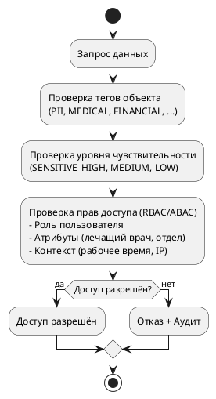
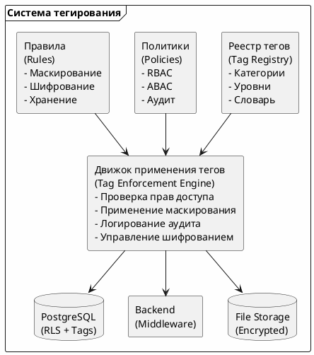

# Концептуальный механизм тегирования данных

## 1. Введение

### 1.1. Назначение документа

Данный документ описывает концептуальный механизм тегирования конфиденциальных данных в системе компании «Медикаменте». Тегирование позволяет автоматически классифицировать данные, применять к ним соответствующие меры защиты и контролировать доступ.

Механизм тегирования является ключевым элементом целевой архитектуры (To-Be). Он связывает реестр конфиденциальных данных ([confidential_data_registry.md](../01_конфиденциальные_данные/confidential_data_registry.md)) с мерами защиты ([protection_measures.md](protection_measures.md)), обеспечивая автоматическое применение политик безопасности на основе метаданных.

### 1.2. Проблемы, решаемые тегированием

Без механизма тегирования применение мер защиты требует ручного управления политиками для каждой таблицы и поля БД. Это приводит к следующим проблемам:

- **Человеческие ошибки** — разработчик может забыть применить шифрование к новому полю
- **Рассинхронизация** — политики безопасности не успевают за изменениями схемы БД
- **Сложность аудита** — трудно определить, какие данные защищены, а какие нет
- **Масштабируемость** — с ростом числа таблиц ручное управление становится невозможным

Тегирование решает эти проблемы путем декларативного описания требований к защите на уровне метаданных.

### 1.3. Цели тегирования

- **Автоматическая классификация данных** по уровням конфиденциальности
- **Применение мер защиты на основе тегов** — шифрование, маскирование, контроль доступа
- **Упрощение контроля доступа (RBAC/ABAC)** — политики доступа выводятся из тегов
- **Аудит и мониторинг операций** с конфиденциальными данными
- **Соответствие требованиям 152-ФЗ** — автоматическое применение требований к ПДн

### 1.4. Принципы тегирования

Механизм тегирования основан на следующих принципах:

1. **Декларативность** — теги описываются декларативно, а не программируются
2. **Автоматизация** — применение мер защиты автоматизируется на основе тегов
3. **Наследование** — теги таблиц наследуются полями, если не переопределены
4. **Верифицируемость** — наличие тегов может быть проверено автоматически
5. **Расширяемость** — система тегов может быть дополнена новыми категориями

---

## 2. Категории тегов

### 2.1. По типу данных

| Тег | Описание | Примеры данных |
|-----|----------|----------------|
| **PII** | Персональные идентификационные данные | ФИО, паспорт, дата рождения |
| **MEDICAL** | Медицинские данные | Диагнозы, анализы, назначения |
| **FINANCIAL** | Финансовые данные | Платежи, зарплаты, счета |
| **INTERNAL** | Внутренние служебные данные | Журналы, реестры, отчёты |
| **PUBLIC** | Публичные данные | Прайс-лист, информация о компании |

### 2.2. По уровню чувствительности

| Тег | Описание | Меры защиты |
|-----|----------|-------------|
| **SENSITIVE_HIGH** | Особо чувствительные данные | Шифрование + ABAC + Аудит |
| **SENSITIVE_MEDIUM** | Чувствительные данные | Шифрование + RBAC + Аудит |
| **SENSITIVE_LOW** | Данные с низким риском | RBAC + Базовый аудит |
| **SENSITIVE_NONE** | Неконфиденциальные данные | Базовый контроль доступа |

### 2.3. По требованиям законодательства

| Тег | Описание | Требования |
|-----|----------|------------|
| **152FZ_PERSONAL** | Персональные данные по 152-ФЗ | Шифрование, аудит, хранение в РФ |
| **MEDICAL_SECRET** | Врачебная тайна | Особый режим доступа, аудит |
| **TAX_SECRET** | Налоговая тайна | Ограниченный доступ, аудит |

### 2.4. По сроку хранения

| Тег | Описание | Срок хранения |
|-----|----------|---------------|
| **RETAIN_PERMANENT** | Бессрочное хранение | Бессрочно |
| **RETAIN_LONG** | Длительное хранение | 25 лет (медицинские карты) |
| **RETAIN_MEDIUM** | Средний срок | 5 лет (финансовые документы) |
| **RETAIN_SHORT** | Краткосрочное хранение | 1 год (журналы записей) |
| **RETAIN_TEMPORARY** | Временное хранение | 30 дней (логи, сессии) |

---

## 3. Источники тегирования

### 3.1. Ручное тегирование

**Кто проставляет:**
- Бизнес-аналитики — при проектировании новых сущностей
- Разработчики — при создании таблиц и полей
- Администраторы безопасности — при настройке политик

**Где хранится:**
- Метаданные БД (комментарии к таблицам и полям)
- Конфигурационные файлы приложения
- Реестр тегов в системе управления доступом

**Пример:**
```sql
-- PostgreSQL: комментарий к полю
COMMENT ON COLUMN patients.full_name IS '{"tags": ["PII", "SENSITIVE_MEDIUM", "152FZ_PERSONAL"]}';

-- PostgreSQL: комментарий к таблице
COMMENT ON TABLE medical_records IS '{"tags": ["MEDICAL", "SENSITIVE_HIGH", "MEDICAL_SECRET", "RETAIN_LONG"]}';
```

### 3.2. Автоматическое тегирование

**Источники:**
- Название поля (full_name → PII)
- Тип данных (DATE + birth → PII)
- Внешние ключи (ссылка на patients → PII)
- Регулярные выражения (шаблон телефона → PII)

**Инструменты:**
- Скрипты миграции БД
- ORM-аннотации в коде приложения
- DLP-системы для сканирования данных

**Пример правил автоматического тегирования:**
```yaml
rules:
  - field_pattern: "*name*"
    tags: [PII, SENSITIVE_MEDIUM]
    
  - field_pattern: "*passport*"
    tags: [PII, SENSITIVE_HIGH, 152FZ_PERSONAL]
    
  - field_pattern: "*diagnosis*"
    tags: [MEDICAL, SENSITIVE_HIGH, MEDICAL_SECRET]
    
  - field_pattern: "*salary*"
    tags: [FINANCIAL, SENSITIVE_HIGH]
    
  - field_pattern: "*phone*"
    tags: [PII, SENSITIVE_MEDIUM, 152FZ_PERSONAL]
    
  - field_pattern: "*email*"
    tags: [PII, SENSITIVE_MEDIUM, 152FZ_PERSONAL]
```

---

## 4. Хранение тегов

### 4.1. Вариант 1: Метаданные БД

**Описание:** Теги хранятся в комментариях к таблицам и полям PostgreSQL.

**Преимущества:**
- Теги привязаны к данным
- Легко查询 через системные представления
- Не требует изменений схемы

**Недостатки:**
- Ограниченный размер комментариев
- Нет индексации для поиска

**Пример запроса:**
```sql
-- Получить теги поля
SELECT obj_description(attrelid, 'pg_class') as table_tags,
       col_description(attrelid, attnum) as column_tags
FROM pg_attribute
WHERE attrelid = 'patients'::regclass
  AND attname = 'full_name';
```

### 4.2. Вариант 2: Отдельная таблица тегов

**Описание:** Теги хранятся в отдельной таблице с ссылками на объекты.

**Схема:**
```sql
CREATE TABLE data_tags (
    id SERIAL PRIMARY KEY,
    object_type VARCHAR(50) NOT NULL,  -- 'table', 'column', 'file'
    object_name VARCHAR(255) NOT NULL, -- имя таблицы/файла
    column_name VARCHAR(255),          -- имя поля (для column)
    tag VARCHAR(100) NOT NULL,
    tag_category VARCHAR(50) NOT NULL, -- 'type', 'sensitivity', 'law', 'retain'
    created_at TIMESTAMP DEFAULT NOW(),
    created_by VARCHAR(100) NOT NULL,
    
    UNIQUE(object_type, object_name, column_name, tag)
);

CREATE INDEX idx_data_tags_lookup ON data_tags(object_type, object_name, column_name);
CREATE INDEX idx_data_tags_by_tag ON data_tags(tag);
```

**Преимущества:**
- Гибкая структура
- Индексация для быстрого поиска
- История изменений тегов

**Недостатки:**
- Дополнительная таблица
- Нужна синхронизация со схемой БД

### 4.3. Вариант 3: Конфигурационный файл

**Описание:** Теги хранятся в YAML/JSON файле конфигурации.

**Пример (YAML):**
```yaml
tables:
  patients:
    tags: [PII, SENSITIVE_MEDIUM, 152FZ_PERSONAL]
    columns:
      full_name:
        tags: [PII, SENSITIVE_MEDIUM, 152FZ_PERSONAL]
        masking: full_mask  # full_mask, partial_mask, none
      birth_date:
        tags: [PII, SENSITIVE_MEDIUM, 152FZ_PERSONAL]
        masking: partial_mask
      phone:
        tags: [PII, SENSITIVE_MEDIUM, 152FZ_PERSONAL]
        masking: phone_mask
        
  medical_records:
    tags: [MEDICAL, SENSITIVE_HIGH, MEDICAL_SECRET, RETAIN_LONG]
    columns:
      diagnosis:
        tags: [MEDICAL, SENSITIVE_HIGH, MEDICAL_SECRET]
        masking: full_mask
      prescriptions:
        tags: [MEDICAL, SENSITIVE_HIGH, MEDICAL_SECRET]
        masking: full_mask
```

**Преимущества:**
- Версионность в Git
- Легко читать и редактировать
- Централизованное управление

**Недостатки:**
- Риск рассинхронизации с БД
- Требует деплоя при изменениях

---

## 5. Использование тегов

### 5.1. Контроль доступа

**На основе тегов применяются политики RBAC/ABAC:**



**Пример политик:**
```yaml
policies:
  - name: "access_to_pii"
    description: "Доступ к PII данным"
    tags: [PII]
    sensitivity: [SENSITIVE_MEDIUM, SENSITIVE_HIGH]
    roles: [admin, reception, doctor, accountant]
    conditions:
      - "user.authenticated == true"
      
  - name: "access_to_medical"
    description: "Доступ к медицинским данным"
    tags: [MEDICAL]
    sensitivity: [SENSITIVE_HIGH]
    roles: [doctor, admin]
    conditions:
      - "user.authenticated == true"
      - "user.role == 'doctor' AND user.id == patient.attending_doctor_id"
      
  - name: "access_to_financial"
    description: "Доступ к финансовым данным"
    tags: [FINANCIAL]
    sensitivity: [SENSITIVE_MEDIUM, SENSITIVE_HIGH]
    roles: [admin, accountant, cashier]
    conditions:
      - "user.authenticated == true"
```

### 5.2. Маскирование данных

**На основе тегов применяется маскирование:**

```yaml
masking_rules:
  - tag: PII
    sensitivity: SENSITIVE_MEDIUM
    rule: partial_mask
    examples:
      full_name: "И***в И.И."
      phone: "+7***1234567"
      email: "i*****v@example.com"
      birth_date: "**.03.1985"
      
  - tag: PII
    sensitivity: SENSITIVE_HIGH
    rule: full_mask
    examples:
      passport: "**********"
      address: "************"
      
  - tag: MEDICAL
    sensitivity: SENSITIVE_HIGH
    rule: full_mask
    examples:
      diagnosis: "********"
      prescriptions: "*************"
```

### 5.3. Аудит

**На основе тегов настраивается аудит:**

```yaml
audit_rules:
  - tag: MEDICAL
    sensitivity: SENSITIVE_HIGH
    audit_level: full
    log:
      - read
      - write
      - delete
      - export
    alert:
      - bulk_access
      - access_outside_work_hours
      - access_by_non_attending_doctor
      
  - tag: PII
    sensitivity: SENSITIVE_MEDIUM
    audit_level: standard
    log:
      - write
      - delete
      - export
      
  - tag: INTERNAL
    sensitivity: SENSITIVE_LOW
    audit_level: minimal
    log:
      - delete
```

### 5.4. Шифрование

**На основе тегов применяется шифрование:**

```yaml
encryption_rules:
  - tag: MEDICAL
    sensitivity: [SENSITIVE_HIGH]
    encryption: AES-256
    key_rotation: 90_days
    
  - tag: PII
    sensitivity: [SENSITIVE_HIGH]
    encryption: AES-256
    key_rotation: 90_days
    
  - tag: FINANCIAL
    sensitivity: [SENSITIVE_HIGH]
    encryption: AES-256
    key_rotation: 90_days
    
  - tag: PII
    sensitivity: [SENSITIVE_MEDIUM]
    encryption: optional
    key_rotation: 180_days
```

### 5.5. Срок хранения

**На основе тегов применяется политика хранения:**

```yaml
retention_rules:
  - tag: RETAIN_PERMANENT
    action: keep_forever
    
  - tag: RETAIN_LONG
    action: delete_after
    period: 25_years
    applies_to: [MEDICAL]
    
  - tag: RETAIN_MEDIUM
    action: delete_after
    period: 5_years
    applies_to: [FINANCIAL]
    
  - tag: RETAIN_SHORT
    action: delete_after
    period: 1_year
    applies_to: [INTERNAL]
    
  - tag: RETAIN_TEMPORARY
    action: delete_after
    period: 30_days
```

---

## 6. Архитектура системы тегирования



---

## 7. Реестр тегов для «Медикаменте»

### 7.1. Таблицы и теги

| Таблица | Теги | Описание |
|---------|------|----------|
| **patients** | PII, SENSITIVE_MEDIUM, 152FZ_PERSONAL, RETAIN_LONG | Персональные данные пациентов |
| **medical_records** | MEDICAL, SENSITIVE_HIGH, MEDICAL_SECRET, RETAIN_LONG | Медицинские карты |
| **appointments** | INTERNAL, SENSITIVE_LOW, RETAIN_SHORT | Журнал записей |
| **payments** | FINANCIAL, SENSITIVE_MEDIUM, RETAIN_MEDIUM | Платежи |
| **employees** | PII, FINANCIAL, SENSITIVE_HIGH, 152FZ_PERSONAL | Данные сотрудников |
| **salaries** | FINANCIAL, SENSITIVE_HIGH, TAX_SECRET, RETAIN_MEDIUM | Зарплаты |
| **inventory** | INTERNAL, SENSITIVE_LOW | ТМЦ |
| **laboratory_results** | MEDICAL, SENSITIVE_HIGH, MEDICAL_SECRET, RETAIN_LONG | Результаты анализов |

### 7.2. Поля и теги (примеры)

| Таблица | Поле | Теги | Маскирование |
|---------|------|------|--------------|
| patients | full_name | PII, SENSITIVE_MEDIUM | partial_mask |
| patients | passport | PII, SENSITIVE_HIGH | full_mask |
| patients | phone | PII, SENSITIVE_MEDIUM | phone_mask |
| medical_records | diagnosis | MEDICAL, SENSITIVE_HIGH | full_mask |
| medical_records | prescriptions | MEDICAL, SENSITIVE_HIGH | full_mask |
| employees | salary | FINANCIAL, SENSITIVE_HIGH | full_mask |
| payments | amount | FINANCIAL, SENSITIVE_MEDIUM | none |

---

## 8. Внедрение тегирования

### Этапы внедрения

| Этап | Задача | Срок |
|------|--------|------|
| 1 | Создание реестра тегов | 1 неделя |
| 2 | Ручное тегирование существующих таблиц | 2 недели |
| 3 | Настройка автоматического тегирования для новых таблиц | 1 неделя |
| 4 | Интеграция с RBAC/ABAC | 2 недели |
| 5 | Настройка маскирования на основе тегов | 2 недели |
| 6 | Настройка аудита на основе тегов | 1 неделя |
| 7 | Тестирование и валидация | 1 неделя |

---

## 9. Выводы

**Механизм тегирования данных:**

1. **Категории тегов:** PII, MEDICAL, FINANCIAL, INTERNAL, PUBLIC + уровни чувствительности
2. **Источники:** Ручное (аналитики, разработчики) + автоматическое (правила)
3. **Хранение:** Метаданные БД + отдельная таблица + конфигурационные файлы
4. **Использование:** Контроль доступа, маскирование, аудит, шифрование, хранение

**Преимущества:**
- Автоматическое применение мер защиты
- Упрощение compliance (152-ФЗ)
- Гибкость и масштабируемость
- Прозрачность для разработчиков