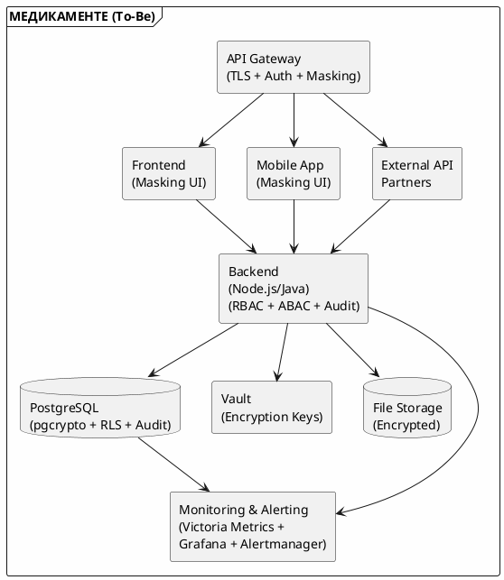

# Меры защиты данных (To-Be)

## 1. Введение

Данный документ описывает меры защиты конфиденциальных данных для целевого состояния (To-Be) системы компании «Медикаменте». Меры разработаны на основе аудита безопасности (As-Is) и направлены на устранение выявленных уязвимостей.

Переход от текущей архитектуры к целевому состоянию требует комплексного подхода к защите данных. Каждая мера защиты выбрана не случайно — она закрывает конкретную уязвимость, выявленную в ходе аудита, и соответствует принципам Privacy By Design. Реализация этих мер позволит компании не только выполнить требования 152-ФЗ, но и создать фундамент для безопасного масштабирования бизнеса.

---

## 2. Классификация мер защиты

### 2.1. По типу защиты
Выбор типа защиты зависит от категории данных и сценария их использования. Например, шифрование обеспечивает конфиденциальность при хранении и передаче, но не подходит для отображения данных пользователю — здесь применяется маскирование. Комбинирование нескольких типов защиты создаёт многоуровневую оборону: даже если злоумышленник преодолеет один рубеж, его остановят следующие.

Для системы «Медикаменте» предлагаются следующие типы мер защиты:

| Тип | Описание | Примеры |
|-----|----------|---------|
| **Шифрование** | Криптографическая защита данных | AES-256, TLS 1.3 |
| **Маскирование** | Скрытие части данных при отображении | +7***1234567, И***в |
| **Обезличивание** | Удаление связи с субъектом ПДн | Замена ФИО на ID |
| **Обфускация** | Запутывание данных | Хэширование с солью |
| **Контроль доступа** | Разрешения на операции | RBAC, ABAC |
| **Аудит** | Логирование операций | Журналы событий |

### 2.2. По этапу применения

Защита данных должна быть непрерывной на всём протяжении их жизненного цикла. Уязвимость на любом этапе — от сбора до удаления — ставит под угрозу всю систему. Например, бессмысленно шифровать данные в базе, если они передаются по открытому каналу, или наоборот — использовать TLS, но хранить данные в открытом виде. Поэтому меры применяются комплексно, перекрывая каждый этап обработки информации.

Меры защиты применяются на всех этапах жизненного цикла данных:

| Этап | Меры |
|------|------|
| **При сборе** | Валидация, минимизация, получение согласия |
| **При хранении** | Шифрование at rest, резервное копирование |
| **При передаче** | Шифрование in transit (TLS) |
| **При обработке** | Маскирование, контроль доступа, аудит |
| **При удалении** | Безопасное удаление, обезличивание |

---

## 3. Таблица мер защиты по категориям данных

### 3.1. Данные пациентов (PII)

Персональные данные пациентов — наиболее массовая категория информации в системе «Медикаменте». Их защита критична для соблюдения 152-ФЗ: утечка ПИИ может привести к штрафам и потере репутации. Маскирование в UI и API предотвращает случайную демонстрацию избыточных данных сотрудникам, а шифрование в БД защищает от компрометации при утечке файлов базы данных.

Ниже приведены меры защиты для каждой категории персональных данных пациентов:

| Категория данных | Метод защиты | Инструмент | Этап применения |
|------------------|--------------|------------|-----------------|
| **ФИО пациента** | Маскирование + Шифрование | PostgreSQL pgcrypto + приложение | Хранение + Отображение |
| **Дата рождения** | Маскирование + Шифрование | PostgreSQL pgcrypto + приложение | Хранение + Отображение |
| **Паспортные данные** | Шифрование | PostgreSQL pgcrypto (AES-256) | Хранение |
| **Адрес прописки** | Шифрование + Контроль доступа | PostgreSQL + RBAC | Хранение + Доступ |
| **Телефон** | Маскирование + Шифрование | PostgreSQL + приложение | Хранение + Отображение |
| **Email** | Маскирование + Шифрование | PostgreSQL + приложение | Хранение + Отображение |
| **Место работы/учёбы** | Шифрование + Контроль доступа | PostgreSQL + RBAC | Хранение + Доступ |
| **История посещений** | Шифрование + Аудит | PostgreSQL + Audit Log | Хранение + Доступ |

**Примеры маскирования:**
- ФИО: `Иванов Иван Иванович` → `И***в И.И.`
- Телефон: `+79161234567` → `+7***1234567`
- Email: `ivanov@example.com` → `i*****v@example.com`
- Дата рождения: `15.03.1985` → `**.03.1985`

---

### 3.2. Медицинские данные

Медицинские данные относятся к специальной категории персональных данных и требуют максимальной защиты. В отличие от обычных ПИИ, здесь применяется модель ABAC — доступ определяется не только ролью сотрудника, но и контекстом: является ли врач лечащим для конкретного пациента. Аудит всех обращений к медицинским данным позволяет выявлять попытки несанкционированного доступа, например, когда сотрудник просматривает карты пациентов, не находящихся под его наблюдением.

В таблице ниже указаны меры защиты для медицинских данных:

| Категория данных | Метод защиты | Инструмент | Этап применения |
|------------------|--------------|------------|-----------------|
| **Диагнозы** | Шифрование + ABAC | PostgreSQL + ABAC (только лечащий врач) | Хранение + Доступ |
| **Жалобы, анамнез** | Шифрование + ABAC | PostgreSQL + ABAC | Хранение + Доступ |
| **Назначения врача** | Шифрование + ABAC | PostgreSQL + ABAC | Хранение + Доступ |
| **Результаты анализов** | Шифрование + ABAC + Аудит | PostgreSQL + ABAC + Audit Log | Хранение + Доступ |
| **Заключения специалистов** | Шифрование + ABAC + Аудит | PostgreSQL + ABAC + Audit Log | Хранение + Доступ |
| **Направления на анализы** | Шифрование + Контроль доступа | PostgreSQL + RBAC | Хранение + Доступ |

**Требования к ABAC:**
- Доступ только у лечащего врача
- Доступ у заведующего отделением
- Доступ по явному разрешению пациента
- Аудит всех обращений

---

### 3.3. Финансовые данные

Финансовые данные охватывают две различные области: платежи пациентов и зарплаты сотрудников. Доступ к ним строго регламентирован — кассиры работают с платежами клиентов, бухгалтеры имеют доступ к обеим категориям, а остальные сотрудники исключены из этого контура. Особое внимание уделяется зарплатам: эта информация является коммерческой тайной и доступна только ограниченному кругу лиц в бухгалтерии.

Меры защиты для финансовых данных представлены в таблице:

| Категория данных | Метод защиты | Инструмент | Этап применения |
|------------------|--------------|------------|-----------------|
| **Сумма платежа** | Шифрование + RBAC | PostgreSQL + RBAC (кассир, бухгалтер) | Хранение + Доступ |
| **История платежей** | Шифрование + RBAC + Аудит | PostgreSQL + RBAC + Audit Log | Хранение + Доступ |
| **Задолженности** | Шифрование + RBAC | PostgreSQL + RBAC | Хранение + Доступ |
| **Зарплаты сотрудников** | Шифрование + RBAC | PostgreSQL + RBAC (только бухгалтерия) | Хранение + Доступ |

---

### 3.4. Данные сотрудников

Данные сотрудников компании также подлежат защите, поскольку содержат персональные данные и служебную информацию. Учётные записи Active Directory защищены с помощью LAPS — пароли локальных администраторов автоматически ротируются и хранятся в зашифрованном виде. Это предотвращает горизонтальное перемещение злоумышленника по сети в случае компрометации одной из учётных записей.

В таблице ниже приведены меры защиты для данных сотрудников:

| Категория данных | Метод защиты | Инструмент | Этап применения |
|------------------|--------------|------------|-----------------|
| **ФИО сотрудника** | Контроль доступа | RBAC (HR, бухгалтерия, руководитель) | Доступ |
| **Паспортные данные** | Шифрование + RBAC | PostgreSQL pgcrypto + RBAC | Хранение + Доступ |
| **ИНН, СНИЛС** | Шифрование + RBAC | PostgreSQL pgcrypto + RBAC | Хранение + Доступ |
| **Зарплата** | Шифрование + RBAC + Аудит | PostgreSQL pgcrypto + RBAC + Audit Log | Хранение + Доступ |
| **Учётные данные AD** | Шифрование + Контроль доступа | Active Directory + LAPS | Хранение + Доступ |

---

### 3.5. Служебные данные

Служебные данные не содержат прямой конфиденциальной информации, но их утечка может косвенно раскрыть сведения о бизнес-процессах компании. Журналы записей и реестры анализов требуют контроля доступа для предотвращения модификации — изменение записей в этих документах может привести к финансовым потерям. Внутренняя переписка защищается при передаче, чтобы исключить перехват служебной информации.

Меры защиты для служебных данных показаны в таблице:

| Категория данных | Метод защиты | Инструмент | Этап применения |
|------------------|--------------|------------|-----------------|
| **Журналы записей** | Контроль доступа | RBAC (ресепшен, врач) | Доступ |
| **Реестры анализов** | Контроль доступа + Аудит | RBAC + Audit Log | Доступ |
| **Внутренняя переписка** | Шифрование | TLS для Exchange | Передача |

---

## 4. Матрица защиты по процессам (DFD)

Матрица защиты связывает меры безопасности с конкретными этапами бизнес-процессов, описанных в диаграммах DFD. Такой подход гарантирует, что каждый шаг процесса защищён соответствующими инструментами. Ниже рассмотрены четыре ключевых процесса компании: запись пациента, ведение медицинской карты, оплата услуг и лабораторные анализы.

### 4.1. Процесс: Запись пациента к врачу

Процесс записи пациента — первая точка контакта клиента с системой. Здесь критически важно защитить телефон пациента: при отправке SMS-подтверждения номер маскируется, чтобы исключить перехват злоумышленником. Аудит регистрации записи позволяет отследить, кто и когда создал запись, что полезно при разборе конфликтных ситуаций.

Меры защиты для этого процесса показаны в таблице:

| Этап (DFD) | Данные | Мера защиты | Инструмент |
|------------|--------|-------------|------------|
| Приём заявки | ФИО, телефон | Шифрование в транзите | TLS 1.3 |
| Проверка пациента | ПИИ из базы | Шифрование at rest + RBAC | PostgreSQL + RBAC |
| Проверка расписания | Расписание | Контроль доступа | RBAC |
| Регистрация записи | ПИИ + слот | Шифрование + Аудит | PostgreSQL + Audit Log |
| Подтверждение | Телефон | Маскирование при отправке | SMS-шлюз |

### 4.2. Процесс: Ведение медицинской карты

Ведение медицинской карты — центральный процесс, в котором формируется и накапливается конфиденциальная информация о пациенте. Тегирование данных на этапе создания карты позволяет автоматически применять политики защиты ко всем связанным записям. Документы (сканы паспортов, согласий, результатов) хранятся в зашифрованном файловом хранилище — это защищает от утечки при компрометации файлового сервера.

Меры защиты для этого процесса показаны в таблице:

| Этап (DFD) | Данные | Мера защиты | Инструмент |
|------------|--------|-------------|------------|
| Регистрация пациента | ПИИ | Шифрование + RBAC | PostgreSQL + RBAC |
| Создание карты | ПИИ + ID | Шифрование + Тегирование | PostgreSQL + Tags |
| Внесение данных приёма | Медицинские данные | Шифрование + ABAC + Аудит | PostgreSQL + ABAC + Audit |
| Сохранение документов | Файлы (JPG, PDF) | Шифрование файлов | Vault / Encrypted FS |

### 4.3. Процесс: Оплата медицинских услуг

Процесс оплаты затрагивает как персональные данные пациентов, так и финансовую информацию. Приём платежей по картам вынесен на платёжный шлюз, соответствующий стандарту PCI DSS — это снимает с компании burden по хранению данных карт. Передача данных в 1С происходит по защищённому каналу, что исключает перехват информации о платежах между системами.

Меры защиты для этого процесса показаны в таблице:

| Этап (DFD) | Данные | Мера защиты | Инструмент |
|------------|--------|-------------|------------|
| Формирование счёта | ПИИ + сумма | Шифрование + RBAC | PostgreSQL + RBAC |
| Приём платежа | Карта/наличные | PCI DSS для карт | Платёжный шлюз |
| Регистрация в журнале | Платёж + ПИИ | Шифрование + Аудит | PostgreSQL + Audit |
| Передача в 1С | Платёж | Шифрование в транзите | TLS / HTTPS API |

### 4.4. Процесс: Лабораторные анализы

Лабораторные анализы — процесс с внешним контуром, так как биоматериал и направления передаются за пределы информационной системы. Результаты анализов возвращаются в систему и автоматически подшиваются в медицинскую карту пациента. ABAC-политика гарантирует, что результаты увидит только лечащий врач, назначивший анализ, и сам пациент.

Меры защиты для этого процесса показаны в таблице:

| Этап (DFD) | Данные | Мера защиты | Инструмент |
|------------|--------|-------------|------------|
| Направление | ПИИ + тип анализа | Шифрование + RBAC | PostgreSQL + RBAC |
| Передача в лабораторию | Биоматериал + направление | Шифрование + Аудит | TLS + Audit |
| Регистрация результатов | Результаты + ПИИ | Шифрование + ABAC + Аудит | PostgreSQL + ABAC + Audit |
| Подшивка в карту | Результаты | Шифрование + ABAC | PostgreSQL + ABAC |

---

## 5. Инструменты и технологии

### 5.1. Шифрование

Единый алгоритм AES-256 выбран для всех сценариев шифрования — это упрощает управление ключами и аудит криптографической защиты. HashiCorp Vault выступает центральным хранилищем ключей шифрования: доступ к ключам строго контролируется, а операции с ключами логируются. Шифрование бэкапов часто упускается из виду, но без него резервные копии становятся лёгкой добычей для злоумышленников.

Инструменты шифрования для системы «Медикаменте»:

| Назначение | Инструмент | Алгоритм |
|------------|------------|----------|
| Шифрование БД | PostgreSQL pgcrypto | AES-256 |
| Шифрование файлов | HashiCorp Vault / LUKS | AES-256 |
| Шифрование в транзите | TLS 1.3 | TLS_RSA_WITH_AES_256_GCM_SHA384 |
| Шифрование бэкапов | pgBackRest + шифрование | AES-256 |

### 5.2. Контроль доступа

Многоуровневая модель контроля доступа обеспечивает защиту на всех уровнях архитектуры. Keycloak централизует управление сессиями и токенами JWT, а CASL реализует гибкие политики авторизации на уровне приложения. Row-Level Security в PostgreSQL дополняет эту защиту, фильтруя данные на уровне БД — даже если злоумышленник обойдёт прикладной уровень, он не получит доступ к чужим записям.

Инструменты контроля доступа для системы «Медикаменте»:

| Назначение | Инструмент | Модель |
|------------|------------|--------|
| Авторизация в системе | Keycloak / CASL | RBAC + ABAC |
| Доступ к БД | PostgreSQL Roles + RLS | Row-Level Security |
| Доступ к файлам | Vault / ACL | RBAC |
| Доменная аутентификация | Active Directory | Kerberos + LDAP |

### 5.3. Аудит и мониторинг

Аудит и мониторинг образуют систему обнаружения инцидентов в реальном времени. ELK-стек агрегирует логи со всех компонентов системы, позволяя восстанавливать полную цепочку действий пользователя. Victoria Metrics собирает метрики производительности и доступности, а Grafana визуализирует их для оперативного анализа. Alertmanager автоматически уведомляет команду при обнаружении аномалий — например, множественных неудачных попыток доступа к медицинским данным.

Инструменты аудита и мониторинга для системы «Медикаменте»:

| Назначение | Инструмент | Данные |
|------------|------------|--------|
| Аудит БД | PostgreSQL Audit Extension | Все запросы к таблицам |
| Аудит приложения | ELK Stack (Elasticsearch, Logstash, Kibana) | Логи приложения |
| Мониторинг | Victoria Metrics + Grafana | Метрики |
| Алертинг | Alertmanager | Уведомления об аномалиях |

### 5.4. Маскирование данных

Маскирование данных реализует принцип минимизации — сотрудник видит только те данные, которые необходимы для выполнения задачи. Frontend-компоненты маскируют данные при отображении, но это не защищает от прямого запроса к API. Поэтому маскирование дублируется на уровне API Gateway или middleware — даже если злоумышленник обойдёт UI, он не получит полные данные через API. Обезличивание для тестовых сред позволяет разработчикам работать с реалистичными данными без риска утечки.

Инструменты маскирования для системы «Медикаменте»:

| Назначение | Инструмент | Пример |
|------------|------------|--------|
| Маскирование в UI | Приложение (React/Frontend) | `+7***1234567` |
| Маскирование в API | API Gateway / Middleware | `И***в И.И.` |
| Обезличивание для тестов | pg_anonymize | Замена на фейковые данные |

---

## 6. Требования к API (маскирование данных)

### 6.1. Общие требования

API-слой — критическая точка защиты, так как через него проходит большинство запросов к данным. Требования к API сформулированы так, чтобы маскирование и контроль доступа применялись автоматически, независимо от клиента (веб-приложение, мобильное приложение, внешний партнёр). Это реализует принцип Privacy by Design — защита встроена в архитектуру, а не добавляется постфактум.

1. **Все API-контракты должны скрывать конфиденциальные данные по умолчанию**
   - Возвращать только необходимые поля
   - Маскировать ПИИ в ответах

2. **Запрет на избыточные данные**
   - Не возвращать полные ФИО, если достаточно инициалов
   - Не возвращать полные номера телефонов

3. **Контроль доступа на уровне API**
   - Проверка прав для каждого запроса
   - Логирование всех запросов к конфиденциальным данным

### 6.2. Примеры API-контрактов

Примеры ниже демонстрируют разницу между небезопасным и безопасным подходами к проектированию API. Неправильный вариант возвращает все данные без маскирования — это типичная ошибка, которая приводит к утечкам. Правильный вариант показывает, как данные должны выглядеть после применения политик маскирования.

**Запрос данных пациента:**
```json
// ❌ Неправильно (избыточные данные)
{
  "id": 123,
  "fullName": "Иванов Иван Иванович",
  "birthDate": "1985-03-15",
  "phone": "+79161234567",
  "email": "ivanov@example.com",
  "address": "г. Москва, ул. Ленина, д. 1"
}

// ✅ Правильно (маскирование)
{
  "id": 123,
  "fullName": "И***в И.И.",
  "birthDate": "**.03.1985",
  "phone": "+7***1234567",
  "email": "i*****v@example.com"
}
```

**Запрос медицинских данных:**
```json
// ✅ Доступ только у лечащего врача
// API проверяет ABAC-политику:
// - requester.role === 'doctor'
// - requester.id === patient.attendingDoctorId
```

---

## 7. Сводная таблица мер по приоритетам

Таблица приоритетов помогает планировать внедрение мер защиты в условиях ограниченных ресурсов. Приоритет P0 assigned мерам, закрывающим критические уязвимости — их необходимо реализовать в первую очередь. Приоритеты P1–P3 включают улучшения, которые важны для долгосрочной безопасности, но могут быть отложены на более поздние спринты.

Меры защиты по приоритетам:

| Приоритет | Мера | Уязвимость (из аудита) | Срок |
|-----------|------|------------------------|------|
| **P0** | Шифрование медицинских данных | U006 | 1 неделя |
| **P0** | Шифрование ПИИ | U001, U004 | 1 неделя |
| **P0** | RBAC для доступа к данным | U004, U005, U013 | 2 недели |
| **P0** | Аудит операций с ПДн | U002, U007, U015 | 2 недели |
| **P1** | Переход на PostgreSQL | U008 | 1 месяц |
| **P1** | Маскирование в UI/API | U001, U006 | 1 месяц |
| **P1** | Резервное копирование | U003 | 1 месяц |
| **P2** | ABAC для медицинских данных | U005, U014 | 2 месяца |
| **P2** | Тегирование данных | U004, U006 | 2 месяца |
| **P2** | Политики хранения и удаления | U019 | 2 месяца |
| **P3** | Полное соответствие Privacy By Design | Все | 6 месяцев |
| **P3** | Сертификация ISO 27001 | Все | 12 месяцев |

---

## 8. Архитектура защиты (To-Be)

Диаграмма ниже визуализирует целевую архитектуру защиты данных. Ключевой элемент — API Gateway, который выступает единой точкой входа и применяет политики аутентификации, авторизации и маскирования. Backend-сервисы взаимодействуют с PostgreSQL, где данные хранятся в зашифрованном виде, а Vault управляет ключами шифрования. Monitoring & Alerting собирает метрики и логи со всех компонентов, обеспечивая сквозную видимость состояния системы.



---

## 9. Выводы

Комплексное применение предложенных мер создаёт многоуровневую систему защиты, где каждый слой дополняет остальные. Шифрование защищает от утечки данных при компрометации хранилищ, маскирование предотвращает случайную демонстрацию избыточной информации, RBAC/ABAC ограничивает доступ авторизованными пользователями, а аудит позволяет обнаруживать и расследовать инциденты.

Предложенные меры защиты:

1. **Шифрование** всех конфиденциальных данных (PII, медицинские, финансовые)
2. **Маскирование** данных при отображении в UI и API
3. **RBAC/ABAC** для разграничения доступа
4. **Аудит** всех операций с персональными данными
5. **Тегирование** для автоматической классификации
6. **Безопасная архитектура** с разделением ответственности

После внедрения предложенных мер компания «Медикаменте» сможет масштабировать бизнес без риска нарушения конфиденциальности данных. Архитектура To-Be закладывает фундамент для будущих интеграций с партнёрами и развития BI/ML-направлений — данные будут защищены по умолчанию, что соответствует принципам Privacy By Design.

Ожидаемые результаты:

- ✅ Соответствие 152-ФЗ
- ✅ Защита от утечек данных
- ✅ Возможность отслеживания несанкционированного доступа
- ✅ Снижение репутационных и финансовых рисков
