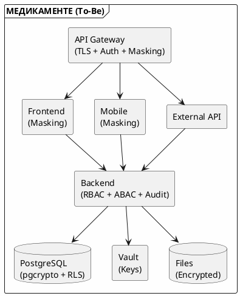

# Итоговый отчёт по Task 1: Анализ безопасности системы

## 0. Резюме для руководства (Executive Summary)

### 0.1. Ключевые выводы

Проведён комплексный анализ безопасности информационной системы компании «Медикаменте». Анализ выявил **критические уязвимости**, требующие немедленного устранения:

- **18 уязвимостей безопасности**, из них 5 критических и 7 высоких
- **Не выполнено 4 из 5 требований 152-ФЗ** — риск штрафов от Роскомнадзора
- **Медицинские данные доступны всем сотрудникам** без разграничения
- **Отсутствует шифрование и аудит** операций с конфиденциальными данными

### 0.2. Рекомендуемые приоритеты

**Приоритет P0 (Немедленно):**
1. Внедрить шифрование AES-256 для медицинских данных и ПИИ
2. Реализовать разграничение доступа (RBAC/ABAC)
3. Настроить аудит всех операций с конфиденциальными данными

**Приоритет P1 (В течение месяца):**
4. Перейти на клиент-серверную СУБД (PostgreSQL)
5. Настроить резервное копирование
6. Внедрить механизм тегирования данных

### 0.3. Ожидаемые результаты

После внедрения предложенных мер:
- ✅ **Соответствие 152-ФЗ** — выполнение требований регуляторов
- ✅ **Защита от утечек** — шифрование и контроль доступа
- ✅ **Возможность расследования инцидентов** — детальный аудит
- ✅ **Снижение рисков** — минимизация репутационных и финансовых потерь

### 0.4. Структура отчёта

Данный итоговый документ консолидирует результаты всех этапов анализа Task 1:
- **Раздел 1-2** — контекст компании и анализ текущей архитектуры
- **Раздел 3** — реестр конфиденциальных данных (35+ категорий)
- **Раздел 4** — диаграммы потоков данных (DFD)
- **Раздел 5** — аудит безопасности (18 уязвимостей)
- **Раздел 6** — меры защиты (To-Be)
- **Раздел 7** — механизм тегирования данных
- **Раздел 8** — требования к API
- **Раздел 9** — DFD с мерами защиты

---

## 1. Введение

### 1.1. Цель документа

Данный документ представляет собой итоговый отчёт по анализу безопасности системы компании «Медикаменте». В отчёте представлены:
- Анализ текущего состояния (As-Is)
- Выявленные конфиденциальные данные
- Диаграммы потоков данных (DFD)
- Аудит безопасности
- Меры защиты (To-Be)
- Механизм тегирования данных
- Требования к API

Отчёт предназначен для технического руководства компании (IT-директор, руководитель отдела безопасности, архитекторы) и служит основанием для планирования работ по модернизации архитектуры безопасности.

### 1.2. Задачи анализа

В рамках Task 1 решены следующие задачи:

1. **Анализ As-Is архитектуры** — изучение текущей инфраструктуры, бизнес-процессов и технологического стека
2. **Выявление конфиденциальных данных** — инвентаризация всех категорий данных, оценка чувствительности
3. **Построение DFD** — визуализация потоков данных на уровнях 0, 1, 2 (нотация Gane and Sarson)
4. **Аудит безопасности** — оценка соответствия 152-ФЗ, выявление уязвимостей
5. **Проектирование мер защиты** — определение инструментов и технологий для To-Be
6. **Разработка концепции тегирования** — механизм автоматической классификации данных

### 1.3. Методология

Анализ проведён с использованием следующих методов и подходов:
- **Процессно-ориентированный анализ** — изучение безопасности в контексте бизнес-процессов
- **DFD (Data Flow Diagram)** — нотация Gane and Sarson для визуализации потоков данных
- **Privacy By Design** — принципы встраивания защиты приватности на этапе проектирования
- **Оценка рисков** — матрица вероятность/влияние для приоритизации уязвимостей

### 1.4. Контекст компании

«Медикаменте» — медицинская клиника с 43 сотрудниками, планирующая 5-кратный рост. Текущая архитектура не обеспечивает безопасность конфиденциальных данных и не соответствует требованиям 152-ФЗ.

**Ключевые характеристики компании:**
- **Отрасль:** Здравоохранение (медицинские услуги)
- **Сотрудников:** 43 (планируется расширение до ~200)
- **Офисов:** 1 (планируется открытие филиалов)
- **Данные:** Медицинские карты пациентов, ПИИ, финансовые данные
- **Регуляторы:** Роскомнадзор (152-ФЗ), Минздрав (врачебная тайна)

---

## 2. Анализ As-Is

### 2.1. Текущая архитектура

Анализ текущей архитектуры (As-Is) выявил фрагментированную инфраструктуру, сложившуюся исторически без единого архитектурного видения. Технологический стек компании отражает типичную ситуацию для малого бизнеса, где приоритет отдавался доступности и простоте внедрения, а не требованиям безопасности.

**Технологический стек:**
- Excel-файлы на файловом сервере
- 1С:Бухгалтерия (файловый режим)
- 1С:Торговля и склад (файловый режим)
- ККМ (интеграция через OLE)
- Exchange Mail Server
- Active Directory

**Ключевые проблемы:**
- Отсутствие шифрования данных
- Нет разграничения доступа (RBAC/ABAC)
- Нет аудита операций
- Файловый режим хранения
- Нет резервного копирования

**Архитектурные риски:**
- **Масштабируемость:** Файловый режим 1С не поддерживает многопользовательскую работу
- **Безопасность:** Данные хранятся в открытом виде, доступны всем сотрудникам домена
- **Надёжность:** Нет резервного копирования, единая точка отказа (физический сервер)

### 2.2. Бизнес-процессы

Для анализа безопасности выделено шесть ключевых бизнес-процессов компании. Каждый процесс представляет собой последовательность операций, в ходе которых обрабатываются конфиденциальные данные. Детальное описание процессов представлено в документе [as_is_analysis.md](01_конфиденциальные_данные/as_is_analysis.md).

| Процесс | Описание | Участники | Критичные данные |
|---------|----------|-----------|------------------|
| Запись к врачу | Ручная запись через ресепшен | Пациент, Ресепшен, Врач | ПИИ (ФИО, телефон) |
| Ведение медкарты | Бумажные + электронные документы | Пациент, Ресепшен, Врач | Медицинские данные |
| Оплата услуг | Касса + 1С | Пациент, Кассир, Бухгалтер | Финансовые данные |
| Учёт ТМЦ | 1С:Торговля и склад | Склад, Бухгалтерия | Данные о стоимости |
| Лабораторные анализы | Внешняя лаборатория | Врач, Лаборатория, Пациент | Результаты анализов |
| Бухгалтерский учёт | 1С:Бухгалтерия | Бухгалтер | Зарплаты, ПДн сотрудников |

---

## 3. Реестр конфиденциальных данных

### 3.1. Классификация данных

Реестр конфиденциальных данных создан на основе анализа бизнес-процессов и служит основой для проектирования мер защиты. Данные классифицированы по четырём уровням чувствительности, определяющим строгость применяемых мер защиты.

| Уровень | Категории | Примеры | Меры защиты |
|---------|-----------|---------|-------------|
| **Высокий** | Медицинские, Паспортные, Зарплаты | Диагнозы, паспорт, salary | AES-256 + ABAC + Аудит |
| **Средний** | ПИИ, Финансовые | ФИО, телефон, платежи | Шифрование + RBAC + Маскирование |
| **Низкий** | Служебные | Журналы, реестры | RBAC + Базовый аудит |
| **Публичный** | Неконфиденциальные | Прайс-лист | Без ограничений |

### 3.2. Данные, требующие защиты

**Количественные показатели:**
- **Всего выявлено:** 35+ категорий данных
- **Требуют защиты:** 25 категорий (71%)
- **Критичные (P1):** 5 категорий
- **Среднего риска (P2):** 4 категории
- **Низкого риска (P3):** 3 категории

**Критичные данные (P1):**
- Медицинские диагнозы и результаты анализов
- Паспортные данные пациентов
- Зарплаты сотрудников
- Учётные данные AD

**Обоснование приоритетов:**
- **P1:** Данные, утечка которых приведёт к серьёзным последствиям (штрафы, репутационный ущерб)
- **P2:** Данные, требующие защиты по 152-ФЗ, но с меньшим потенциальным ущербом
- **P3:** Служебные данные, утечка которых не нанесёт прямого ущерба

---

## 4. Диаграммы DFD (As-Is)

### 4.1. Созданные диаграммы

| Уровень | Файл | Описание |
|---------|------|----------|
| Level 0 | `01_конфиденциальные_данные/dfd_level0_context.drawio` | Context Diagram — взаимодействие с внешними субъектами |
| Level 1 | `01_конфиденциальные_данные/dfd_level1_appointment.drawio` | Запись пациента к врачу |
| Level 1 | `01_конфиденциальные_данные/dfd_level1_patient_card.drawio` | Ведение медицинской карты |
| Level 1 | `01_конфиденциальные_данные/dfd_level1_payment.drawio` | Оплата медицинских услуг |
| Level 1 | `01_конфиденциальные_данные/dfd_level1_inventory.drawio` | Учёт ТМЦ |
| Level 1 | `01_конфиденциальные_данные/dfd_level1_laboratory.drawio` | Лабораторные анализы |
| Level 1 | `01_конфиденциальные_данные/dfd_level1_accounting.drawio` | Бухгалтерский учёт |
| Level 2 | `01_конфиденциальные_данные/dfd_level2_appointment_details.drawio` | Детализация записи к врачу |
| Level 2 | `01_конфиденциальные_данные/dfd_level2_medical_data_details.drawio` | Детализация медицинских данных |
| Level 2 | `01_конфиденциальные_данные/dfd_level2_payment_details.drawio` | Детализация оплаты |

### 4.2. Нотация

Использована нотация **Gane and Sarson**:
- Процесс: прямоугольник со скруглёнными углами
- Хранилище: разомкнутый прямоугольник
- Внешний субъект: прямоугольник
- Поток данных: стрелка с подписью

---

## 5. Аудит безопасности (As-Is)

### 5.1. Выявленные уязвимости

**Всего выявлено:** 18 уязвимостей  
**Критические:** 8  
**Высокие:** 6  
**Средние:** 4

| ID | Уязвимость | Уровень |
|----|------------|---------|
| U004 | Медкарты доступны всем сотрудникам | Критический |
| U005 | Нет разделения по лечащим врачам | Критический |
| U006 | Нет шифрования медицинских данных | Критический |
| U013 | Результаты анализов доступны всем | Критический |
| U014 | Нет разграничения по пациентам | Критический |
| U001 | Excel-файлы с ПИИ доступны всем | Высокий |
| U002 | Нет логирования доступа | Высокий |
| U007 | Нет аудита просмотра карт | Высокий |

### 5.2. Соответствие 152-ФЗ

| Требование | Статус |
|------------|--------|
| Шифрование ПДн при хранении | ❌ Не выполнено |
| Шифрование ПДн при передаче | ❌ Не выполнено |
| Разграничение доступа | ❌ Не выполнено |
| Учёт обращений к ПДн | ❌ Не выполнено |
| Хранение на территории РФ | ✅ Выполнено |

### 5.3. Оценка рисков

| Риск | Вероятность | Влияние | Уровень |
|------|-------------|---------|---------|
| Утечка медицинских данных | Высокая | Критическое | **Критический** |
| Утечка ПИИ пациентов | Высокая | Высокое | **Высокий** |
| Штрафы от Роскомнадзора | Средняя | Высокое | **Высокий** |
| Репутационные потери | Средняя | Критическое | **Высокий** |

---

## 6. Меры защиты (To-Be)

### 6.1. Таблица мер защиты

| Категория данных | Метод защиты | Инструмент |
|------------------|--------------|------------|
| **ФИО пациента** | Маскирование + Шифрование | PostgreSQL pgcrypto + приложение |
| **Паспортные данные** | Шифрование | PostgreSQL pgcrypto (AES-256) |
| **Диагнозы** | Шифрование + ABAC | PostgreSQL + ABAC |
| **Результаты анализов** | Шифрование + ABAC + Аудит | PostgreSQL + ABAC + Audit Log |
| **Зарплаты сотрудников** | Шифрование + RBAC | PostgreSQL + RBAC |

### 6.2. Матрица мер по процессам

| Процесс | Меры защиты |
|---------|-------------|
| Запись к врачу | TLS, RBAC, PII-теги, Аудит, Маскирование |
| Ведение медкарты | TLS, AES-256, ABAC, MEDICAL-теги, Аудит, Vault |
| Оплата услуг | TLS, RBAC, FINANCIAL-теги, Аудит, PCI DSS |
| Лабораторные анализы | TLS, AES-256, ABAC, MEDICAL-теги, Аудит |

### 6.3. Архитектура To-Be



---

## 7. Механизм тегирования данных

### 7.1. Категории тегов

| Категория | Теги | Описание |
|-----------|------|----------|
| **По типу** | PII, MEDICAL, FINANCIAL, INTERNAL, PUBLIC | Тип данных |
| **По чувствительности** | SENSITIVE_HIGH, MEDIUM, LOW, NONE | Уровень риска |
| **По законодательству** | 152FZ_PERSONAL, MEDICAL_SECRET, TAX_SECRET | Требования |
| **По хранению** | RETAIN_PERMANENT, LONG, MEDIUM, SHORT, TEMPORARY | Сроки |

### 7.2. Источники тегирования

| Источник | Описание | Пример |
|----------|----------|--------|
| **Ручное** | Аналитики, разработчики | Комментарии в БД, конфиги |
| **Автоматическое** | Правила по названию поля | `*name*` → PII |

### 7.3. Использование тегов

| Применение | Описание |
|------------|----------|
| **Контроль доступа** | RBAC/ABAC на основе тегов |
| **Маскирование** | Автоматическое применение правил |
| **Аудит** | Логирование операций с тегами |
| **Шифрование** | Применение AES-256 к тегированным полям |
| **Хранение** | Политики удаления по тегам RETAIN_* |

---

## 8. Требования к API

### 8.1. Маскирование данных

**Все API-контракты должны скрывать конфиденциальные данные по умолчанию:**

```json
// ❌ Неправильно
{
  "fullName": "Иванов Иван Иванович",
  "phone": "+79161234567",
  "email": "ivanov@example.com"
}

// ✅ Правильно
{
  "fullName": "И***в И.И.",
  "phone": "+7***1234567",
  "email": "i*****v@example.com"
}
```

### 8.2. Контроль доступа

- Проверка прав для каждого запроса
- ABAC для медицинских данных (только лечащий врач)
- Логирование всех запросов к конфиденциальным данным

### 8.3. Запрет на избыточные данные

- Не возвращать полные ФИО, если достаточно инициалов
- Не возвращать полные номера телефонов
- Возвращать только необходимые поля

---

## 9. DFD с мерами защиты (To-Be)

### 9.1. Созданные диаграммы

| Уровень | Файл | Описание |
|---------|------|----------|
| Level 0 | `03_улучшения/dfd_level0_tobe.drawio` | Context Diagram с мерами защиты |
| Level 1 | `03_улучшения/dfd_level1_appointment_tobe.drawio` | Запись к врачу (с защитами) |
| Level 1 | `03_улучшения/dfd_level1_patient_card_tobe.drawio` | Медкарта (с защитами) |
| Level 1 | `03_улучшения/dfd_level1_payment_tobe.drawio` | Оплата (с защитами) |
| Level 1 | `03_улучшения/dfd_level1_laboratory_tobe.drawio` | Лаборатория (с защитами) |

### 9.2. Обозначения мер защиты

| Значок | Мера |
|--------|------|
| 🔒 | TLS — Шифрование в транзите |
| 🔐 | RBAC/ABAC/AES — Контроль доступа / Шифрование |
| 🏷️ | Теги — Классификация данных |
| 🎭 | Маскирование — Скрытие данных при отображении |
| 📝 | Аудит — Логирование операций |

---

## 10. Рекомендации по внедрению

### 10.1. Приоритеты

| Приоритет | Мера | Срок |
|-----------|------|------|
| **P0** | Шифрование медицинских данных и ПИИ | 1 неделя |
| **P0** | RBAC для доступа к данным | 2 недели |
| **P0** | Аудит операций с ПДн | 2 недели |
| **P1** | Переход на PostgreSQL | 1 месяц |
| **P1** | Маскирование в UI/API | 1 месяц |
| **P1** | Резервное копирование | 1 месяц |
| **P2** | ABAC для медицинских данных | 2 месяца |
| **P2** | Тегирование данных | 2 месяца |
| **P3** | Полное соответствие Privacy By Design | 6 месяцев |

### 10.2. Дорожная карта

```
Неделя 1-2:   🔐 Шифрование критичных данных (P0)
Неделя 3-4:   👥 RBAC + Аудит (P0)
Месяц 2:      🗄️ PostgreSQL + Маскирование (P1)
Месяц 3:      🏷️ Тегирование + ABAC (P2)
Месяц 4-6:    📋 Privacy By Design (P3)
Месяц 7-12:   📜 ISO 27001 (P3)
```

---

## 11. Выводы

### 11.1. Текущее состояние

**Оценка:** Неудовлетворительное

- ❌ 18 уязвимостей (8 критических)
- ❌ Не выполнено 4 из 5 требований 152-ФЗ
- ❌ Не применены принципы Privacy By Design
- ❌ Высокий риск утечек и штрафов

### 11.2. Ожидаемые результаты после внедрения

- ✅ Соответствие 152-ФЗ
- ✅ Защита от утечек данных
- ✅ Возможность отслеживания несанкционированного доступа
- ✅ Снижение репутационных и финансовых рисков

### 11.3. Список артефактов

**Документы:**
- [01_конфиденциальные_данные/as_is_analysis.md](01_конфиденциальные_данные/as_is_analysis.md) — Анализ As-Is
- [01_конфиденциальные_данные/confidential_data_registry.md](01_конфиденциальные_данные/confidential_data_registry.md) — Реестр данных
- [02_аудит_мер/security_audit.md](02_аудит_мер/security_audit.md) — Аудит безопасности
- [03_улучшения/protection_measures.md](03_улучшения/protection_measures.md) — Меры защиты
- [03_улучшения/data_tagging_concept.md](03_улучшения/data_tagging_concept.md) — Механизм тегирования
- [REPORT.md](REPORT.md) — Итоговый отчёт (этот файл)

**Диаграммы DFD (As-Is):**
- [01_конфиденциальные_данные/dfd_level0_context.drawio](01_конфиденциальные_данные/dfd_level0_context.drawio)
- [01_конфиденциальные_данные/dfd_level1_appointment.drawio](01_конфиденциальные_данные/dfd_level1_appointment.drawio)
- [01_конфиденциальные_данные/dfd_level1_patient_card.drawio](01_конфиденциальные_данные/dfd_level1_patient_card.drawio)
- [01_конфиденциальные_данные/dfd_level1_payment.drawio](01_конфиденциальные_данные/dfd_level1_payment.drawio)
- [01_конфиденциальные_данные/dfd_level1_inventory.drawio](01_конфиденциальные_данные/dfd_level1_inventory.drawio)
- [01_конфиденциальные_данные/dfd_level1_laboratory.drawio](01_конфиденциальные_данные/dfd_level1_laboratory.drawio)
- [01_конфиденциальные_данные/dfd_level1_accounting.drawio](01_конфиденциальные_данные/dfd_level1_accounting.drawio)
- [01_конфиденциальные_данные/dfd_level2_appointment_details.drawio](01_конфиденциальные_данные/dfd_level2_appointment_details.drawio)
- [01_конфиденциальные_данные/dfd_level2_medical_data_details.drawio](01_конфиденциальные_данные/dfd_level2_medical_data_details.drawio)
- [01_конфиденциальные_данные/dfd_level2_payment_details.drawio](01_конфиденциальные_данные/dfd_level2_payment_details.drawio)

**Диаграммы DFD (To-Be):**
- [03_улучшения/dfd_level0_tobe.drawio](03_улучшения/dfd_level0_tobe.drawio)
- [03_улучшения/dfd_level1_appointment_tobe.drawio](03_улучшения/dfd_level1_appointment_tobe.drawio)
- [03_улучшения/dfd_level1_patient_card_tobe.drawio](03_улучшения/dfd_level1_patient_card_tobe.drawio)
- [03_улучшения/dfd_level1_payment_tobe.drawio](03_улучшения/dfd_level1_payment_tobe.drawio)
- [03_улучшения/dfd_level1_laboratory_tobe.drawio](03_улучшения/dfd_level1_laboratory_tobe.drawio)

---

## 12. Глоссарий

| Термин | Определение |
|--------|-------------|
| **PII** | Personally Identifiable Information — персональные идентификационные данные |
| **RBAC** | Role-Based Access Control — контроль доступа на основе ролей |
| **ABAC** | Attribute-Based Access Control — контроль доступа на основе атрибутов |
| **DFD** | Data Flow Diagram — диаграмма потоков данных |
| **Privacy By Design** | Конфиденциальность по умолчанию — принцип проектирования |
| **Data Minimization** | Минимизация данных — сбор только необходимых данных |
| **RLS** | Row-Level Security — безопасность на уровне строк БД |

---

**Документ подготовлен в рамках Task 1 спринта 10.**
**Все артефакты сохранены в папке `Task1/` с новой структурой:**
- `01_конфиденциальные_данные/` — выявление данных и DFD As-Is
- `02_аудит_мер/` — аудит безопасности
- `03_улучшения/` — меры защиты и DFD To-Be
